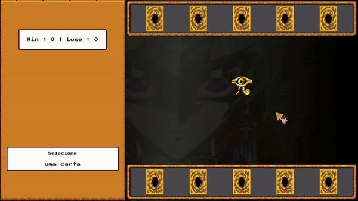

# Yu-Gi-Oh! | Jo-ken-pô Edition  

Bem vindo ao **Yu-Gi-Oh | Jo-ken-po Edition**! Este é um jogo baseado no famoso anime "Yu-Gi-Oh". Trata-se de um jogo estilo jo-ken-po, o tradicional "pedra, papel, tesoura". Diferente do original no qual os jogadores fazem os sinais com a mão, este é um jogo de cartas. As cartas são representativas de monstros, feitiços e armadilhas do universo de Yu-Gi-Oh, e cada uma delas possui um dos atributos possíveis: pedra, papel ou tesoura. E assim como no jogo original: Papel > Pedra > Tesoura > . Prepare-se para um duelo estratégico onde você invocará cartas lendárias para superar seu oponente!

  

### ⚙ Tecnologias Utilizadas

- HTML5 e CSS3 para a estrutura e aparência do jogo.
- JavaScript para a lógica de programação e interatividade.
- RPGUI - Framework para interface de usuário com temática de RPG.

### ✔️ Funcionalidades Incríveis

- Interface gráfica com as cartas representativas dos elementos do jogo.
- Funcionalidade de seleção do jogador e da máquina.
- Lógica de jogo para determinar o vencedor com base nas regras do pedra-papel-tesoura.
- Exibição do resultado da rodada e da pontuação.

### 🕹️ Como Jogar ?

1. Clone este repositório para sua máquina local e abra o arquivo `index.html` em seu navegador web.
2. Ou então [Clique aqui] (https://mari4souza.github.io/js-yugioh-game/).
3. Selecione uma carta representando sua jogada (monstro, feitiço ou armadilha).
4. O adversário (máquina) fará sua jogada aleatoriamente.
5. O resultado da rodada será exibido, indicando quem foi o vencedor ou se houve empate.
6. A pontuação será atualizada conforme os resultados das rodadas.

### 💡 Diferenciais em relação ao projeto original

- Substituição das cartas antigas por outras com design mais atual.
- Adição de **nove** novas cartas com variação de atributos! 
- Adaptação do layout, tonando-o **responsivo**.

### 🤝🏻 Contribuição

Contribuições são bem-vindas! Se você deseja melhorar este jogo, adicionar novos recursos ou corrigir problemas, sinta-se à vontade para abrir um _pull request_.

### 📝 Créditos

Este jogo foi desenvolvido como parte de um projeto educacional da Digital Innovation One.
